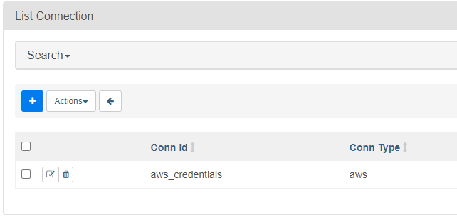

# Project: Counter Strike Matches Pipeline

> by Filipe Macedo 01 June 2021

## 1. Project Description

One of the most famous games in my generation is Counter Strike and my favorite to play when I am trying to chill in my leasure time. In the past weeks watching professional matches I was thinking: What are the most important skills to a professional player or team ? What are the difference between the winners and the losers ? With this thought in my mind I searched about Counter Strike data and I found the website htlv.org that have data about 96000 professional matches.   

As a data engineer, I tried to build an ETL pipeline that extracts their data from the website save in S3 in JSON format, processes them using Spark, and loads the data back into S3 as parquet files. This will allow me to do an analytic job to continue finding insights in the estracted data.

In the figure bellow you can see the arquitecture of the proposed solution.

## 2. Datasets

We'll be working with three datasets that will be scraped using the scrapy tool and uploaded to S3 in the JSON format. Here are the S3 links for each:

    Match Results data: s3://fpmacedo/match_results/match_results.json
    Match Players data: s3://fpmacedo/match_players/match_players.json
    Players Stats data: s3://fpmacedo/players_stats/players_stats.json

### Match Results Dataset

The first dataset is a JSON that contains metadata about 96000 matches results. Each match result is one line in the JSON file

And below is an example of what a single match_result line, looks like.

    { 
      "match_id": 121121,
      "match_link": "/stats/matches/mapstatsid/121121/lyngby-vikings-vs-100pg",
      "team_1_id": "8963",
      "team_1_link": "/stats/teams/8963/lyngby-vikings",
      "team_1_name": "Lyngby Vikings",
      "team_2_id": "10525",
      "team_2_link": "/stats/teams/10525/100pg",
      "team_2_name": "100PG",
      "team_1_score": "16",
      "team_2_score": "13",
      "event_name": "Funspark ULTI 2021 Europe Regional Series 2",
      "map": "Nuke",
      "data_unix": 1622213100000,
      "offset": 100
    }

###  Match Players Dataset

The second dataset consists in a JSON file that cointains the players scores during each match we have 10 players in any match so we have 960k lines in this file.

And below is an example of what a single match_players line, looks like.

    {
      "match_id": 121138,
      "match_link": "/stats/matches/mapstatsid/121138/lyngby-vikings-vs-kova",
      "team_name": "KOVA",
      "players_link": "/stats/players/15180/twixie",
      "player_id": 15180,
      "player_nick": "Twixie",
      "kills": "22",
      "hs": "9",
      "assists": "8",
      "flash_assists": "9",
      "deaths": "20",
      "kdratio": "71.4%",
      "adr": "70.4",
      "fkdiff": "+2",
      "rating": "1.07"
    }

### Players Stats Dataset

The third dataset consists in a JSON file that cointains the players general informations, like age, country and others.

And below is an example of what a single players_stats line, looks like.

    {
      "player_id": 9019,
      "player_nick": "Surreal",
      "player_link": "https://www.hltv.org/stats/players/9019/surreal",
      "player_age": "25",
      "player_country": "United Kingdom",
      "kast": "69.6%",
      "impact": "1.03",
      "total_kills": "21854",
      "hs_percentage": "43.1%",
      "total_deaths": "22445",
      "kd_ratio": "0.97",
      "dmg_round": "72.5",
      "gnd_dmg_round": "3.2",
      "maps_played": "1271",
      "rounds_played": "33147",
      "kills_round": "0.66",
      "assists_round": "0.13",
      "deaths_round": "0.68",
      "saved_by_round": "0.10",
      "save_team_round": "0.09",
      "rating_1": "0.97"
    }

## 3. Schema for Match Analysis

Using the extracted datasets, we'll need to create a star schema optimized for analytics. This includes the following tables.

## 5. ETL Pipeline

1. Clone the repository and follow [this video](https://www.youtube.com/watch?v=aTaytcxy2Ck&t=479s) to run Airflow.

2. In airflow Connections you need to create the connections bellow with your AWS keys:

3. In the airflow variables you need to create the variables bellow with your AWS acess key, secret and region:

4. Open http://localhost:8080/ and execute the dag.

